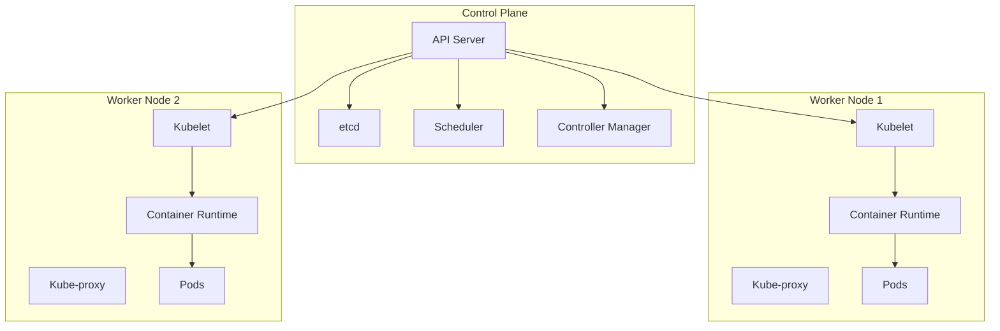
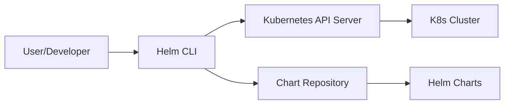

# Kubernetes and Helm Theory Guide

## Table of Contents
1. [Kubernetes Fundamentals](#kubernetes-fundamentals)
2. [Kubernetes Architecture](#kubernetes-architecture)
3. [Core Kubernetes Objects](#core-kubernetes-objects)
4. [Helm Fundamentals](#helm-fundamentals)
5. [Helm Charts Deep Dive](#helm-charts-deep-dive)
6. [Best Practices](#best-practices)

---

## Kubernetes Fundamentals

### What is Kubernetes?

**Kubernetes (K8s)** is an open-source container orchestration platform that automates the deployment, scaling, and management of containerized applications. It was originally developed by Google and is now maintained by the Cloud Native Computing Foundation (CNCF).

### Why Kubernetes?

- **Automated Deployment**: Deploy containers across a cluster of machines
- **Self-Healing**: Automatically restarts failed containers and replaces nodes
- **Horizontal Scaling**: Scale applications up or down based on demand
- **Service Discovery & Load Balancing**: Automatically distributes network traffic
- **Storage Orchestration**: Automatically mount storage systems
- **Automated Rollouts & Rollbacks**: Update applications without downtime
- **Secret & Configuration Management**: Securely manage sensitive information

### Key Concepts

- **Container**: A lightweight, standalone executable package that includes everything needed to run an application
- **Cluster**: A set of nodes (machines) that run containerized applications
- **Node**: A worker machine in Kubernetes (can be VM or physical machine)
- **Pod**: The smallest deployable unit in Kubernetes (one or more containers)

---

## Kubernetes Architecture



### Control Plane Components

1. **API Server** (`kube-apiserver`)
   - Front-end for the Kubernetes control plane
   - Exposes the Kubernetes API
   - All communication goes through the API server

2. **etcd**
   - Consistent and highly-available key-value store
   - Stores all cluster data (state, configuration, metadata)
   - Backup etcd for disaster recovery

3. **Scheduler** (`kube-scheduler`)
   - Watches for newly created Pods with no assigned node
   - Selects a node for them to run on based on resource requirements

4. **Controller Manager** (`kube-controller-manager`)
   - Runs controller processes
   - Examples: Node Controller, Replication Controller, Endpoints Controller

### Worker Node Components

1. **Kubelet**
   - Agent that runs on each node
   - Ensures containers are running in Pods
   - Communicates with the API server

2. **Kube-proxy**
   - Network proxy that runs on each node
   - Maintains network rules for Pod communication
   - Implements Kubernetes Service concept

3. **Container Runtime**
   - Software responsible for running containers
   - Examples: Docker, containerd, CRI-O

---

## Core Kubernetes Objects

### 1. Pods

**Pods** are the smallest deployable units in Kubernetes. A Pod encapsulates one or more containers, storage resources, a unique network IP, and options that govern how containers should run.

**Key Points:**
- Pods are ephemeral (temporary)
- Each Pod gets its own IP address
- Containers in the same Pod share network and storage
- Pods are typically created via higher-level controllers (Deployments, StatefulSets)

**Example Pod YAML:**
```yaml
apiVersion: v1
kind: Pod
metadata:
  name: nginx-pod
  labels:
    app: nginx
spec:
  containers:
  - name: nginx
    image: nginx:1.21
    ports:
    - containerPort: 80
```

### 2. Deployments

**Deployments** provide declarative updates for Pods and ReplicaSets. They manage the rollout of new versions and can rollback if issues occur.

**Key Points:**
- Ensures desired number of Pod replicas are running
- Enables rolling updates with zero downtime
- Supports rollback to previous versions
- Self-healing: recreates Pods if they fail

**Example Deployment YAML:**
```yaml
apiVersion: apps/v1
kind: Deployment
metadata:
  name: nginx-deployment
spec:
  replicas: 3
  selector:
    matchLabels:
      app: nginx
  template:
    metadata:
      labels:
        app: nginx
    spec:
      containers:
      - name: nginx
        image: nginx:1.21
        ports:
        - containerPort: 80
```

### 3. Services

**Services** provide a stable endpoint to access a set of Pods. They enable load balancing and service discovery.

**Service Types:**

1. **ClusterIP** (default)
   - Exposes service on an internal IP in the cluster
   - Only reachable from within the cluster

2. **NodePort**
   - Exposes service on each Node's IP at a static port
   - Accessible from outside the cluster using `<NodeIP>:<NodePort>`

3. **LoadBalancer**
   - Creates an external load balancer (cloud provider specific)
   - Assigns a public IP to the service

4. **ExternalName**
   - Maps service to a DNS name

**Example Service YAML:**
```yaml
apiVersion: v1
kind: Service
metadata:
  name: nginx-service
spec:
  type: LoadBalancer
  selector:
    app: nginx
  ports:
  - protocol: TCP
    port: 80
    targetPort: 80
```

### 4. ConfigMaps

**ConfigMaps** store non-confidential configuration data as key-value pairs. Pods can consume ConfigMaps as environment variables, command-line arguments, or configuration files.

**Example ConfigMap YAML:**
```yaml
apiVersion: v1
kind: ConfigMap
metadata:
  name: app-config
data:
  database_url: "postgresql://db:5432/mydb"
  log_level: "info"
```

### 5. Secrets

**Secrets** store sensitive information (passwords, tokens, keys). Similar to ConfigMaps but designed for confidential data.

**Example Secret YAML:**
```yaml
apiVersion: v1
kind: Secret
metadata:
  name: db-secret
type: Opaque
data:
  username: YWRtaW4=  # base64 encoded
  password: cGFzc3dvcmQ=  # base64 encoded
```

### 6. Namespaces

**Namespaces** provide a mechanism to divide cluster resources between multiple users or teams. They create logical partitions within a cluster.

**Default Namespaces:**
- `default`: Default namespace for objects with no other namespace
- `kube-system`: For Kubernetes system objects
- `kube-public`: Publicly readable across the cluster
- `kube-node-lease`: For node heartbeat data

### 7. Persistent Volumes (PV) and Persistent Volume Claims (PVC)

**Persistent Volumes** provide storage that exists beyond the Pod lifecycle.

- **PV**: A piece of storage in the cluster (provisioned by admin)
- **PVC**: A request for storage by a user

**Example PVC YAML:**
```yaml
apiVersion: v1
kind: PersistentVolumeClaim
metadata:
  name: mysql-pvc
spec:
  accessModes:
    - ReadWriteOnce
  resources:
    requests:
      storage: 5Gi
```

### 8. Ingress

**Ingress** manages external access to services in a cluster, typically HTTP/HTTPS. It provides load balancing, SSL termination, and name-based virtual hosting.

**Example Ingress YAML:**
```yaml
apiVersion: networking.k8s.io/v1
kind: Ingress
metadata:
  name: app-ingress
spec:
  rules:
  - host: myapp.example.com
    http:
      paths:
      - path: /
        pathType: Prefix
        backend:
          service:
            name: nginx-service
            port:
              number: 80
```

---

## Helm Fundamentals

### What is Helm?

**Helm** is the package manager for Kubernetes. It simplifies the deployment and management of applications on Kubernetes clusters.

Think of Helm as:
- **apt/yum** for Ubuntu/CentOS
- **npm** for Node.js
- **pip** for Python

### Why Use Helm?

1. **Simplification**: Deploy complex applications with a single command
2. **Reusability**: Package applications for easy sharing and reuse
3. **Version Control**: Track and manage application versions
4. **Rollback**: Easy rollback to previous versions
5. **Templating**: Use variables to customize deployments
6. **Dependency Management**: Manage application dependencies

### Helm Architecture



### Key Helm Concepts

1. **Chart**: A Helm package containing all resource definitions to run an application
2. **Release**: An instance of a chart running in a Kubernetes cluster
3. **Repository**: A place where charts are stored and shared
4. **Values**: Configuration parameters for a chart

### Helm Chart Structure

```
mychart/
├── Chart.yaml          # Metadata about the chart
├── values.yaml         # Default configuration values
├── charts/             # Dependencies (other charts)
├── templates/          # Kubernetes manifest templates
│   ├── deployment.yaml
│   ├── service.yaml
│   ├── ingress.yaml
│   ├── _helpers.tpl   # Template helpers
│   └── NOTES.txt      # Usage notes displayed after install
└── .helmignore        # Files to ignore when packaging
```

### Chart.yaml

Contains metadata about the chart:

```yaml
apiVersion: v2
name: my-app
description: A Helm chart for my application
type: application
version: 1.0.0        # Chart version
appVersion: "1.0"     # Application version
keywords:
  - web
  - nginx
maintainers:
  - name: Your Name
    email: you@example.com
```

### values.yaml

Default configuration values for the chart:

```yaml
replicaCount: 3

image:
  repository: nginx
  tag: "1.21"
  pullPolicy: IfNotPresent

service:
  type: LoadBalancer
  port: 80

resources:
  limits:
    cpu: 100m
    memory: 128Mi
  requests:
    cpu: 50m
    memory: 64Mi
```

---

## Helm Charts Deep Dive

### Template Functions

Helm uses Go templating with additional functions:

**Common Template Syntax:**

1. **Variables**:
   ```yaml
   image: {{ .Values.image.repository }}:{{ .Values.image.tag }}
   ```

2. **Conditionals**:
   ```yaml
   {{- if .Values.ingress.enabled }}
   apiVersion: networking.k8s.io/v1
   kind: Ingress
   # ... ingress configuration
   {{- end }}
   ```

3. **Loops**:
   ```yaml
   {{- range .Values.environments }}
   - name: {{ .name }}
     value: {{ .value }}
   {{- end }}
   ```

4. **Default Values**:
   ```yaml
   replicas: {{ .Values.replicaCount | default 1 }}
   ```

5. **Include Templates**:
   ```yaml
   labels:
     {{- include "mychart.labels" . | nindent 4 }}
   ```

### Helm Commands

**Essential Helm Commands:**

```bash
# Add a chart repository
helm repo add bitnami https://charts.bitnami.com/bitnami

# Update repositories
helm repo update

# Search for charts
helm search repo nginx

# Install a chart
helm install my-release bitnami/nginx

# Install with custom values
helm install my-release -f custom-values.yaml bitnami/nginx

# List installed releases
helm list

# Get release status
helm status my-release

# Upgrade a release
helm upgrade my-release bitnami/nginx

# Rollback to a previous version
helm rollback my-release 1

# Uninstall a release
helm uninstall my-release

# Create a new chart
helm create mychart

# Lint a chart
helm lint mychart/

# Package a chart
helm package mychart/

# Template (render without installing)
helm template my-release mychart/

# Show values
helm show values bitnami/nginx
```

### Helm Repositories

**Working with Repositories:**

```bash
# Add popular repositories
helm repo add stable https://charts.helm.sh/stable
helm repo add bitnami https://charts.bitnami.com/bitnami
helm repo add prometheus-community https://prometheus-community.github.io/helm-charts

# List repositories
helm repo list

# Remove a repository
helm repo remove stable

# Update all repositories
helm repo update
```

---

## Best Practices

### Kubernetes Best Practices

1. **Use Namespaces** for resource isolation
2. **Set Resource Limits** (CPU, memory) on all containers
3. **Use Liveness and Readiness Probes** for health checks
4. **Never use `latest` tag** - always pin specific versions
5. **Use ConfigMaps and Secrets** instead of hardcoding values
6. **Implement RBAC** for security and access control
7. **Use Labels and Annotations** for organization and metadata
8. **Regular Backups** of etcd data
9. **Monitor and Log** everything
10. **Use Rolling Updates** for zero-downtime deployments

### Helm Best Practices

1. **Document your charts** with good README files
2. **Use semantic versioning** for chart versions
3. **Template everything** that might need customization
4. **Provide sensible defaults** in values.yaml
5. **Use `_helpers.tpl`** for reusable template snippets
6. **Validate charts** with `helm lint` before deploying
7. **Test with `helm template`** to preview rendered manifests
8. **Use `.helmignore`** to exclude unnecessary files
9. **Pin dependency versions** in Chart.yaml
10. **Include NOTES.txt** with helpful post-installation instructions

### Security Best Practices

1. **Scan container images** for vulnerabilities
2. **Run containers as non-root** users
3. **Use Network Policies** to control traffic between Pods
4. **Enable Pod Security Policies/Standards**
5. **Encrypt Secrets** at rest
6. **Regularly update** Kubernetes and Helm versions
7. **Use ServiceAccounts** with minimal permissions
8. **Enable Audit Logging** to track cluster activities

---

## Summary

### Kubernetes Core Concepts
- **Pods**: Smallest deployable units containing one or more containers
- **Deployments**: Manage Pod replicas and rolling updates
- **Services**: Provide stable networking and load balancing
- **ConfigMaps/Secrets**: Store configuration and sensitive data
- **Namespaces**: Isolate resources within a cluster
- **Ingress**: Manage external HTTP/HTTPS access

### Helm Core Concepts
- **Charts**: Packages containing all Kubernetes resources
- **Values**: Configuration parameters for customization
- **Templates**: Go templates for generating Kubernetes manifests
- **Releases**: Deployed instances of charts
- **Repositories**: Storage for Helm charts

### Key Takeaways

1. Kubernetes orchestrates containers across clusters
2. Helm simplifies Kubernetes deployments through packaging and templating
3. Both tools follow declarative configuration approaches
4. Understanding the architecture helps troubleshoot issues
5. Best practices ensure secure, scalable, and maintainable deployments

---

**Ready to practice?** Proceed to the Lab Guide to get hands-on experience with Kubernetes and Helm!
